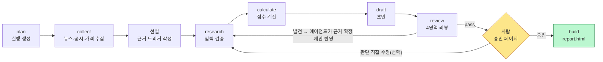
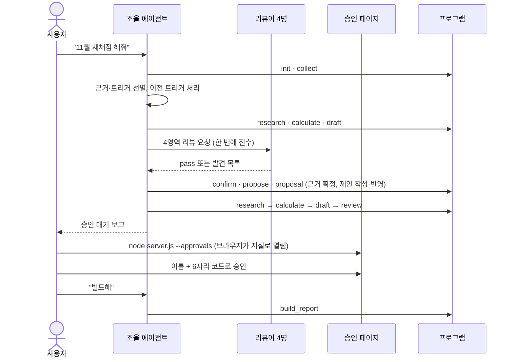
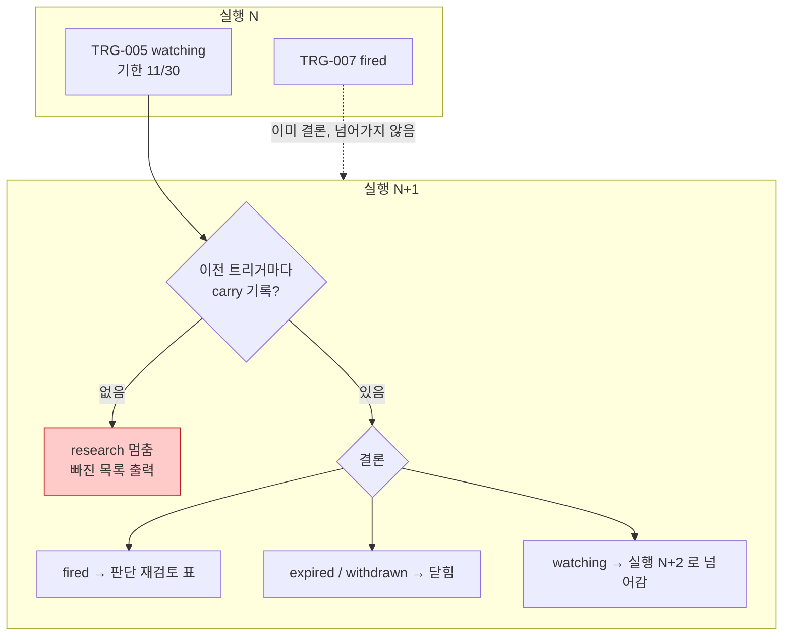
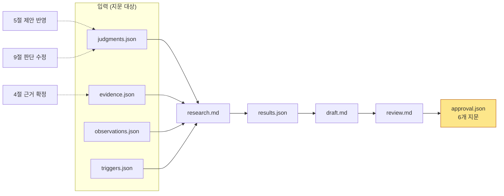
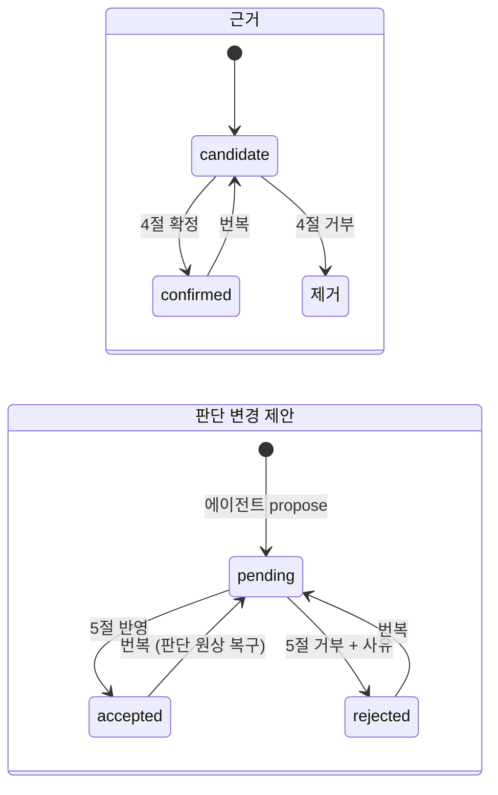
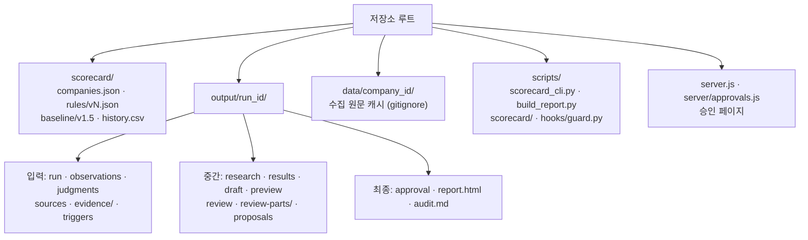

# 채점 실행 안내서

AI 기업 9-factor 채점을 한 번 돌리는 전 과정과 사용법을 정리한 문서입니다. 규칙의 내용은 `rules.md`, 코드 구조와 스키마는 `structure.md`, 에이전트 작업 계약은 루트 `AGENTS.md` 와 `.claude/skills/score-*/SKILL.md` 에 있습니다. 이 문서는 "무엇을 어떤 순서로 누르고 실행하는가" 만 다룹니다. (2026-10-02 기준)

## 1. 한눈에 보기

- **점수는 프로그램이 계산합니다.** 사람과 에이전트는 입력(공시 숫자, 정성 판단, 근거)만 다루고, 점수 칸을 직접 고치는 길은 없습니다.
- **모든 단계가 지문(sha256)으로 묶여 있습니다.** 입력이 한 글자라도 바뀌면 뒤 단계의 리뷰와 승인이 무효가 됩니다.
- **승인은 사람만 합니다.** 에이전트는 "승인 대기" 에서 멈추고, 사람이 승인 페이지에서 승인하면 빌드합니다.



입력이 바뀌면 화살표가 research 로 돌아갑니다. 리뷰 발견을 에이전트가 반영했든 사람이 승인 페이지에서 판단을 직접 고쳤든, 바뀐 입력으로 계산과 리뷰를 다시 해야 승인할 수 있기 때문입니다.

## 2. 누가 무엇을 하나

| 주체 | 하는 일 | 하지 않는 일 |
| --- | --- | --- |
| 사용자 | 승인·승인 취소(필요하면 판단 직접 수정) | 점수 칸 직접 수정 |
| 조율 에이전트 (Claude Code) | 수집·선별·단계 실행, 리뷰어 지시, 근거 확정·거부, 판단 변경 제안 작성·반영·거부(2026-10-07 사용자 지시) | 승인·승인 취소 |
| 리뷰어 (별도 세션 4개) | 사실·출처 / 재무 계산 / 규칙 일관성 / 출력·가독성 검토 | 입력 수정 |
| 프로그램 | 검증, 계산, 지문 대조, 훅으로 금지 동작 차단 | 판단 |



## 3. 실행 순서와 명령

명령은 모두 저장소 루트에서 `uv run --frozen python -X utf8` 뒤에 붙여 실행합니다. Claude Code 에서는 `/score-plan`, `/score-collect` 처럼 슬래시 명령으로도 부를 수 있고, `/score-goal "<요청>"` 은 plan 부터 review 까지 한 번에 돌린 뒤 승인 대기에서 멈춥니다.

| 순서 | 단계 | 명령 | 결과 (`output/<run_id>/`) |
| --- | --- | --- | --- |
| 1 | 실행 생성 | 새로: `scripts/scorecard_cli.py init <run_id> --rule <현행 버전> --as-of YYYY-MM-DD --title "…" --request "…"`<br/>이어받기: `scripts/scorecard_cli.py init <run_id> --from-run <이전 run_id> --as-of … --price-as-of … --info-cutoff …`<br/>현행 버전은 `rules.md` 머리말에 있습니다. 이어받기는 `--rule`·날짜를 주지 않으면 이전 실행 값을 그대로 씁니다. | `plan.md`, `run.json`, `observations.json`, `judgments.json`, `sources.json` |
| 2 | 수집 | `scripts/scorecard_cli.py collect <run_id> --kind all` | `evidence/candidates.json`, ⑥ 가격 관측 |
| 3 | 트리거 후보 보기 | `scripts/scorecard_cli.py trigger-candidates <run_id>` | 화면 출력만 (파일 변경 없음) |
| 4 | 선별 | 에이전트가 후보를 골라 작성 | `evidence/evidence.json`, `triggers.json` |
| 5 | 리서치 | `scripts/scorecard_cli.py research <run_id>` | `research.md` |
| 6 | 계산 | `scripts/scorecard_cli.py calculate <run_id>` | `results.json`, `preview.md` |
| 7 | 초안 | `scripts/scorecard_cli.py draft <run_id>` | `draft.md` |
| 8 | 리뷰 | `scripts/scorecard_cli.py review-template <run_id>` 뒤 4영역 리뷰 | `review.md`, `review-parts/` |
| 9 | 판단 변경 제안 | `scripts/scorecard_cli.py propose <run_id> --company <id> --factor F5 --set … --evidence "…" --reason "…"` | `proposals.json` |
| 10 | 승인 | 사람이 승인 페이지에서 (5절) | `approval.json` |
| 11 | 빌드 | `scripts/build_report.py <run_id>` | `report.html`, `audit.md`, `scorecard/history.csv` 에 행 추가 |

상태 확인은 `scripts/scorecard_cli.py status <run_id>` 로, 승인 전 계약 검사는 `scripts/validate_report_contract.py <run_id>` 로 합니다. 인자는 각 명령의 `--help` 로 확인합니다.

공시 수집에는 `SEC_UA`(SEC 가 요구하는 이름과 연락처, 영문)가 필요합니다. 원본 폴더 루트의 `.env` 에 사용자가 직접 적습니다.

### 실행을 새로 만들까, 이어받을까

| 상황 | 방법 | 처리해야 할 이전 트리거 |
| --- | --- | --- |
| 정기 재채점 | `init --from-run <직전 실행>` | 직전 실행의 관찰 중 트리거 + 직전 실행이 처리하지 않고 넘긴 더 이전 트리거 |
| 기업 추가만 | `/score-extend` (`init --from-run … --add-companies a,b`) | 위와 같음. 기존 기업이 움직이지 않았음은 `diff` 가 증명 |
| 기준선에서 새로 | `init --rule <현행 버전> …` | 기준선 트리거 전부 (TRIG-001~039) |

## 4. 트리거 처리 (2026-10-01 도입)

트리거는 "이런 일이 생기면 이 판단을 다시 본다" 는 재채점 조건입니다. 미래 점수는 저장하지 않습니다(C-14).

### 4.1 매 실행에서 할 일

1. `trigger-candidates` 로 이전 트리거마다 관련 뉴스·공시를 봅니다. 기업 이름을 뺀 단어가 겹치는 후보를 상위 5건씩 보여 주고, 기한 뒤에 나온 소식은 따로 표시합니다. 판정은 하지 않습니다.
2. 이전 트리거마다 이번 실행의 `triggers.json` 항목에 확인 기록을 남깁니다.

```json
{
  "trigger_id": "TRG-012",
  "company_id": "oracle",
  "status": "fired",
  "source_ids": ["SRC-EDGAR-0001341439-26-000123"],
  "carry": {
    "ref": "baseline/v1.5:TRIG-011",
    "checked_at": "2026-11-05",
    "finding": "9/10 Q1 FY27 실적 8-K 확인, RPO 중 OpenAI 비중 재확인 필요"
  }
}
```

3. 결론은 `status` 로 냅니다.

| 결론 | 언제 | 조건 |
| --- | --- | --- |
| `fired` 발동 | 사건이 일어났다 | 근거(`evidence_ids`)나 출처(`source_ids`)가 반드시 있어야 함 |
| `expired` 만료 | 기한이 지나 의미가 없어졌다 | — |
| `withdrawn` 철회 | 더 볼 필요가 없다 (중복, 규칙 변경 등) | 이유를 `finding` 에 |
| `watching` 계속 관찰 | 아직 일어나지 않았다 | 기한이 기준일 이후여야 함 |

같은 사건이 둘이면 하나로 잇고 나머지는 "중복" 으로 철회합니다. 여러 기업에 걸친 트리거는 기업별 항목으로 나눠 같은 `ref` 를 가리켜도 됩니다.

### 4.2 프로그램이 막는 것

research 단계가 아래 셋 가운데 하나라도 걸리면 목록을 보여 주고 멈춥니다. 규칙 v1.8 이상이고 `triggers.json` 이 있는 실행에만 적용합니다.

- 확인 기록이 없는 이전 트리거가 있다.
- 확인 날짜(`checked_at`)가 이번 실행 생성일보다 앞선다. 이전 파일을 복사만 한 경우가 여기에 걸립니다.
- 기준일이 기한을 넘겼는데 `watching` 으로 남아 있다.



`research.md` 에는 "이전 트리거 처리" 표와 "발동 트리거 재검토 대상" 표가 실립니다. 후자는 발동한 트리거가 가리키는 판단을 이번 실행에서 고쳤는지, 그대로 두었는지를 보여 줍니다. 그대로 두었다면 유지 이유를 `finding` 에 적고, 사실·출처 리뷰어가 그 기록을 전부 확인합니다.

## 5. 승인 페이지 사용법

### 5.1 띄우기

1. 원본 폴더 터미널에서 `node server.js --approvals` 를 실행합니다. 터미널에 6자리 일회용 코드가 나옵니다.
2. 승인 페이지(`http://127.0.0.1:3000/approve/<run_id>`)가 기본 브라우저에서 저절로 열립니다(2026-10-07). `output/` 아래 채점 실행 폴더 가운데 파일이 가장 최근에 바뀐 실행을 엽니다. 다른 실행이면 `node server.js --approvals <run_id>` 처럼 이름을 붙이고, 자동 열기를 끄려면 `SCORECARD_NO_OPEN=1` 을 줍니다.
3. 승인에 성공하면 서버는 스스로 내려갑니다. 그 뒤의 "사이트에 연결할 수 없음" 은 정상입니다.

### 5.2 페이지의 절

| 절 | 내용 | 사람이 하는 일 | 코드 필요 |
| --- | --- | --- | --- |
| 1 | 실행 기본 정보 | 확인 | — |
| 2 | 기업별 점수·순위 변동 | 확인 | — |
| 3 | 리뷰 결과 | 확인 | — |
| 4 | 수집 근거 후보 | 확정·거부, 확정한 것은 번복 | 아니요 |
| 5 | 판단 변경 제안 | 반영 또는 거부(사유 필수), 결정 번복 | 아니요 |
| 6 | 활성 트리거 | 확인 | — |
| 7 | 미결 규칙 결정 | 확인 | — |
| 8 | 무결성 지문 | 확인 | — |
| 9 | 전체 판단 표 | factor 탭 → 기업 카드에서 직접 수정 | 아니요 |
| 참조 | 근거 문장의 규칙 용어 | 뜻 확인 | — |
| 10 | 승인 / 승인 취소 | 이름 + 6자리 코드 | 예 |

10절은 승인할 수 없는 상태이면 승인 폼 대신 막힌 이유와 다음 할 일을 보여 줍니다. 버튼을 눌러도 보던 위치는 그대로 유지되고, 결과는 알림 상자로 나옵니다.

### 5.3 무엇을 누르면 다시 돌려야 하나



4절·5절·9절에서 무엇이든 바꾸면 입력 지문이 바뀝니다. 그러면 에이전트에게 "다시 돌려" 라고 말하면 됩니다. 에이전트가 `research → calculate → draft → review-template --force → 리뷰` 를 다시 돌리고, 끝나면 페이지를 새로고침해 승인합니다. 결정은 한 번에 모아서 내리는 편이 반복을 줄입니다.

### 5.4 상태가 바뀌는 방식



새 판단(`status: new`)은 확정(confirmed)된 근거만 인용할 수 있습니다. 제안을 반영하면 판단 안의 `revision_history` 에 이전 값이 쌓입니다.

### 5.5 판단을 고칠 수 있는 범위

| factor | 고칠 수 있는 것 |
| --- | --- |
| ① ④ ⑧ | 점수(`score`)와 근거 문장 |
| ③ | 네 기준(`criteria`)과 근거 문장 |
| ⑤ | 등급(`grade`: A 0~2, H 0~−3)과 근거 문장 |
| ⑦ | 매트릭스(`matrix`)와 근거 문장 |
| ⑨ | 게이트 입력(`gate_inputs`)과 근거 문장 |
| ② ⑥ | 대상이 아닙니다 (⑥ 은 공시 숫자로만 계산) |

### 5.6 근거 세 칸 (2026-10-07)

판단 근거는 **판정 · 올릴 근거 · 내릴 근거** 세 칸으로 씁니다. 판정은 `evidence`, 올릴 근거는 `evidence_up`, 내릴 근거는 `evidence_down` 입니다. 규칙 v1.9 이상 실행은 판단을 쓰는 시점(`judge`·`propose` 반영)과 검증기(`validate_report_contract`)가 형식을 막습니다. 세 칸 문장만 바꾸는 수정은 모든 factor(② ⑥ 포함)에 되고, 판정 값·상태를 건드리지 않습니다.

기준은 하나입니다. **"이 사실 하나만 놓고 보면 점수가 오르는가, 내리는가?"** 답할 수 있으면 올릴·내릴 근거, 답할 수 없으면 판정 칸입니다.

| 유형 | 예 | 처리 |
| --- | --- | --- |
| 판정 재료 문장(기준 통과·실패, 관문 결과, 점수 문장) | "③ 모방 불가능성은 실패다", "⑨ 는 0 에서 끝난다" | 판정 칸 |
| 한 사실이 양쪽으로 읽힘 | 경쟁 제품 출시 + 같은 주 협력 지속 | 사실 둘로 쪼개 각 칸으로. 저울질한 결론은 판정 칸 |
| 지표끼리 결론이 갈림 | 전년 대비 가속, 직전 분기 대비 감속 | 각 칸으로. 판정 칸에 어느 지표로 판정했는지 |
| 사실은 있는데 품질이 약함 | 보도 제목 값, 예상 미달 | 방향 칸에 두고 약점은 같은 줄 단서로 |
| 계획·발표(규칙상 점수 미반영) | 2027년 배치 계획 | 방향 칸에 두고 "계획이라 점수에 넣지 않는다"를 같은 줄에 |
| 아직 판정 못 한 것 | FCF 추세 '모름' | 판정 칸에 "미확인"과 이유. 방향 칸에 넣지 않는다(모름 ≠ 0) |

- 점수 방향은 숫자 기준입니다. 함정 항목(⑥~⑨, 음수)에서 올릴 근거는 함정이 얕다는 사실, 내릴 근거는 함정이 깊다는 사실입니다.
- 한 칸이 비면 빈 목록으로 두고, 화면에는 "없음"으로 나옵니다. 두 방향 칸이 모두 비면 안 됩니다. 판정 칸은 비울 수 없습니다.
- `counter_evidence` 는 쓰지 않습니다(비워 둡니다). 반대 방향 사실은 올릴·내릴 근거 칸에 씁니다.
- 명령: `propose … --evidence "판정 문장" --up "올릴 근거" --down "내릴 근거"`. 여러 번 주면 그 목록이 칸 전체가 되고, `--up ""` 만 주면 그 칸을 "없음"으로 비웁니다. `--json` 은 `evidence_after`·`evidence_up_after`·`evidence_down_after`(judge 는 `evidence`·`evidence_up`·`evidence_down`)입니다.
- 기준선에서 새로 만든 v1.9 이상 실행은 판단에 방향 칸이 없어 검증기가 막습니다. 판단마다 세 칸 제안을 올려 반영한 뒤 진행합니다. `init --from-run` 은 판단을 그대로 옮기므로 세 칸을 이어받습니다.

## 6. 리뷰

네 영역을 별도 세션 리뷰어가 맡고, 체크리스트 Q01~Q23 을 채웁니다.

| 영역 | 담당 | 보는 것 |
| --- | --- | --- |
| 사실·출처 | `fact-checker` | 숫자·출처·URL, 근거 원문 대조, 이전 트리거 처리 기록 |
| 재무 계산 | 별도 세션 | 환율·ADR·TTM·FCF·런웨이·단위·부호, 계산 경로 대조 |
| 규칙 일관성 | 별도 세션 | 판정 입력과 규칙 판정표, 같은 잣대(Q03), 체크리스트 전체 |
| 출력·가독성 | `report-designer` | 초안·HTML 숫자 일치, 낡은 비교 문장, 모바일 표시 |

**한 번에 끝냅니다.** 2026-10-01 시험 실행에서 리뷰가 세 바퀴 돈 뒤 정한 원칙입니다(`score-review` 스킬의 「한 번에 끝낸다」 절).

- 표본 대조를 하지 않습니다. 이어받은 판단까지 전부 보고, 발견은 한 번에 다 적습니다.
- `needs_fix` 는 점수·순위·체크리스트 판정을 바꾸는 발견에만 씁니다. 나머지는 영역 파일의 "다음 실행 과제" 절로 넘기고 승인을 막지 않습니다.
- 사람에게 올릴 제안은 리뷰가 끝난 뒤 한 묶음으로 올립니다.
- 체크리스트 fail 이 이전 실행에서 이어받은 판단의 기존 논리 때문이고, 이번에 잣대를 바꾸지 않았으며, 규칙 파일 긴장 목록(TEN-)에 재검토 시점과 함께 등록돼 있으면 승인을 막지 않습니다. 근거 칸에 TEN 번호를 적습니다.

### 자동화 뒤에도 사람이 보는 것

프로그램이 산수와 잣대 적용을 맡아도 아래는 사람이 직접 봅니다.

1. **부외 약정의 A/B/C 분류.** 이미 개시된 리스인지, 미개시 확정 약정인지, 우발 보증인지는 연간보고서 주석을 읽어야 가를 수 있습니다(`rules.md` ⑨ 게이트 4).
2. **정성 판정의 최종값.** ⑤ 의 A·H 등급, ⑦ 의 두 축, ③ 의 세 기준, ② 의 경로는 기준표가 있어도 마지막은 판단입니다.
3. **규칙이 결론을 만들고 있지 않은가.** 규칙을 바꾸고 싶어질 때, 그 이유가 회사에 관한 사실인지 채점자의 직관인지 먼저 묻습니다. 결과가 이상해 보인다는 이유로 한 회사에만 예외를 두는 것이 대표적인 실패입니다.
4. **분기마다 한 번 전체를 읽습니다.** 검사기는 형식과 산수를 잡지만, 문장 사이의 의미 모순은 사람이 처음부터 끝까지 읽어야 보입니다.
5. **"지금 상태"를 적은 줄이 최신인지 봅니다.** 세션이 첫 전제로 읽는 상태 줄(README 의 최신 실행 등)이 낡으면, 다음 세션들이 며칠 동안 틀린 전제로 시작합니다.

## 7. 폴더와 파일



| 파일 | 손으로 고치나 |
| --- | --- |
| `output/<run_id>/` 의 md·html | 아니요. 생성물입니다 |
| `judgments.json` | 승인 페이지 또는 `judge`·`proposal` 명령으로만 |
| `evidence.json`, `triggers.json` | 에이전트가 선별 단계에서 작성, 확정은 승인 페이지 |
| `approval.json`, `scorecard/history.csv`, 기준선 | 아니요. 훅이 막습니다 |

## 8. 자주 막히는 곳

| 증상 | 원인 | 할 일 |
| --- | --- | --- |
| `[FAIL] 승인 전 계약 검증 실패: research.md 가 현재 입력 해시와 다름` | 승인 페이지에서 근거·판단을 바꿔 지문이 바뀜 | 에이전트에게 "다시 돌려" |
| 10절에 승인 폼 대신 "막힌 이유" | 리뷰가 pass 가 아니거나 해시가 맞지 않음 | 표시된 다음 할 일을 따름 |
| 승인 뒤 "사이트에 연결할 수 없음" | 승인 성공 후 서버가 정상 종료 | 상태 명령으로 `approval_valid: true` 확인 |
| `이전 트리거 N건을 처리하지 않았다` | 확인 기록이 빠짐 | `trigger-candidates` 로 보고 `carry` 작성 |
| `기한이 지났는데 계속 관찰인 트리거` | 기준일이 기한을 넘김 | 결론을 내거나 기한을 늦추고 `note` 에 이유 |
| PowerShell 에 `! uv run …` 을 붙여 넣어 오류 | `!` 는 Claude Code 입력창 전용 접두어 | 터미널에서는 `!` 없이 실행 |
| 공시 수집이 `skipped_no_user_agent` | `SEC_UA` 가 없음 | `.env` 에 영문으로 적음 |

## 9. 11월 정기 재채점 체크리스트

1. `init <run_id> --from-run ai-scorecard-2026-10-rescore` (가장 최근에 승인된 실행을 이어받는다)
2. `collect <run_id> --kind all`
3. `trigger-candidates <run_id>` 로 이전 트리거 확인
4. 근거·트리거 선별, 이전 트리거마다 `carry` 기록. 중복(TRIG-010·035 Anthropic 상장, TRIG-003·025 NVIDIA ACIE)과 ⑥ 경계(TRIG-030, v1.7 부터 구간표 없음)는 철회
5. `research → calculate → draft`
6. 리뷰 4영역을 한 번에, 전수로
7. 리뷰 발견을 한 묶음으로 `propose` 하고, 원문과 대조한 뒤 에이전트가 `proposal` 로 반영·거부 → `research` 부터 다시
8. "승인 대기" 보고 → 사람이 승인 페이지에서 승인
9. 빌드
